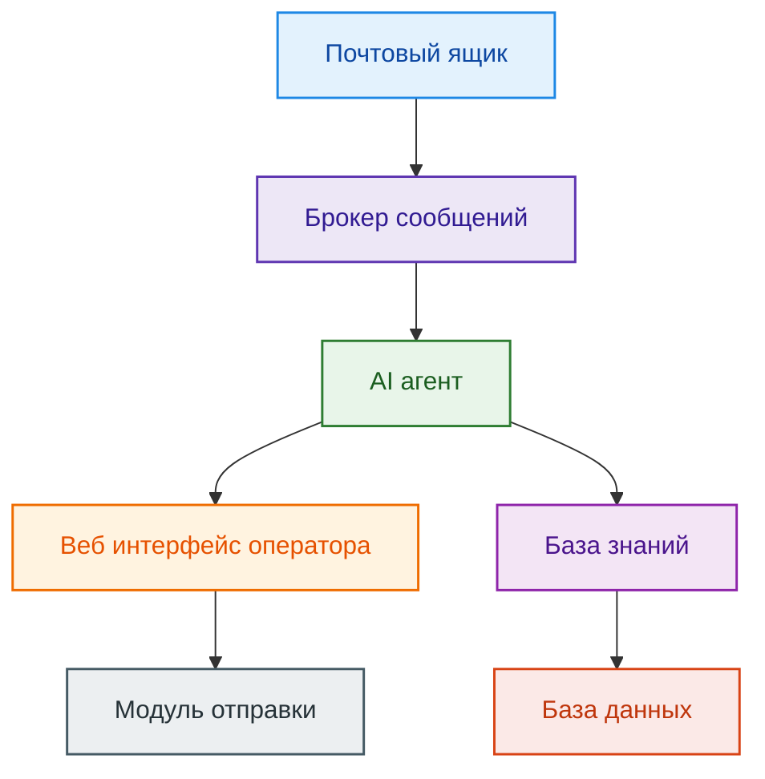

# Система обработки писем с AI-агентом

## Шаги пользователя

### 1. Поступление письма
Письмо приходит в почтовый ящик техподдержки.

### 2. Обработка письма системой
Система фиксирует новое письмо и отправляет его в брокер сообщений.

### 3. AI-агент получает письмо
- Забирает текст письма.
- Выделяет ключевые данные: сущности, параметры, тип запроса.

### 4. Поиск решения
- Обращается к базе знаний: история обращений, FAQ, документация.
- Находит похожие кейсы и формирует проект ответа.

### 5. Предложение решения оператору
В веб-интерфейсе оператор видит:
- текст обращения;
- предложенный ответ;
- ссылки и данные из базы знаний.

Оператор может:
- принять ответ;
- отредактировать;
- написать свой ответ.

### 6. Отправка ответа
После подтверждения оператором письмо отправляется клиенту.

### 7. Запись в таблицу статистики
При нажатии кнопки `Записать в таблицу`:
- сохраняются ФИО/ID клиента, проблема, решение, дата, исполнитель;
- новая запись отображается в веб-интерфейсе.

---

## Архитектура системы

### Компоненты и взаимодействие
1. **Модуль работы с почтой**  
   - получает письма и отправляет события в брокер сообщений.
2. **Брокер сообщений**  
   - передает письма AI-агенту.
3. **AI-агент**  
   - парсит текст письма;  
   - выделяет сущности и намерения;  
   - ищет похожие кейсы в базе знаний;  
   - формирует черновик ответа;  
   - передает данные веб-интерфейсу.
4. **База знаний / история обращений**  
   - PostgreSQL + полнотекстовый поиск / векторный поиск;  
   - хранит прошлые кейсы, решения, FAQ.
5. **Веб-интерфейс оператора**  
   - показывает письма и ответы агента;  
   - позволяет редактировать и отправлять ответы;  
   - кнопка для записи решения в таблицу;  
   - просмотр таблицы решённых обращений.
6. **Модуль отправки почты**  
   - отправляет письмо клиенту после подтверждения оператора.
7. **База данных**  
   - таблица входящих писем;  
   - таблица решений и статистики.

### Схема

---

## Риски и минимизация

### 1. Высокая нагрузка на систему при большом потоке писем
**Проблема:** AI-обработка и работа с базой знаний могут стать узким местом.  
**Решение:**
- Кэшируем повторяющиеся обращения к базе знаний.
- На этапе MVP ограничиваем глубину анализа и избегаем тяжёлых операций.
- Оптимизируем структуру хранения данных и индексы под частые запросы.

### 2. Сложность настройки и расширения AI-агента
**Проблема:** Настройка модели и добавление новых сценариев может занимать много времени.  
**Решение:**
- Начинаем с простого набора промптов и базового сценария.
- Готовим небольшую тестовую выборку писем для быстрой проверки качества.
- Постепенно усложняем логику после стабилизации базового варианта.
- Новые сценарии добавляем по шагам: сначала простой вариант, потом улучшения.
- Дополнительные функции выделяем в отдельные модули, чтобы не ломать текущую логику.
- Заранее готовим базовый процесс для дообучения.

---
